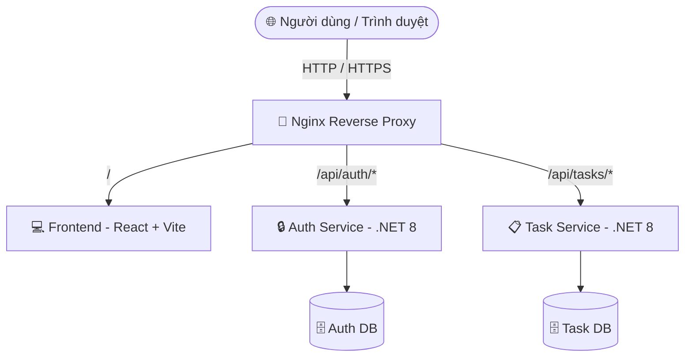

# 🚀 DevBoard — Microservices Kanban & Task Management App

DevBoard là một ứng dụng quản lý công việc và bảng Kanban hiện đại, được xây dựng dựa trên kiến trúc **Microservices** mạnh mẽ và linh hoạt. Dự án sử dụng cấu trúc **Monorepo** giúp dễ dàng quản lý toàn bộ mã nguồn của cả Backend, Frontend và các cấu hình triển khai hệ thống.

---

## 🗺️ Kiến trúc Hệ thống

Ứng dụng được thiết kế theo mô hình Microservices với cổng Reverse Proxy để điều hướng lưu lượng truy cập:



---

## 📂 Cấu trúc Thư mục (Monorepo)

```
devboard/
├── .github/
│   └── workflows/
│       └── ci.yml           # Cấu hình GitHub Actions CI/CD (placeholder)
├── frontend/                # Ứng dụng Frontend (React + Vite + TypeScript)
├── nginx/
│   └── nginx.conf           # Cấu hình Reverse Proxy & Load Balancer (placeholder)
├── services/
│   ├── auth-service/        # Dịch vụ xác thực và phân quyền (.NET 8 Web API)
│   └── task-service/        # Dịch vụ quản lý công việc & Kanban (.NET 8 Web API)
├── docker-compose.yml       # Cấu hình Docker để khởi chạy toàn bộ hệ thống (placeholder)
└── README.md                # Tài liệu hướng dẫn dự án
```

---

## 🛠️ Công nghệ Sử dụng

| Thành phần | Công nghệ | Phiên bản | Mô tả |
| :--- | :--- | :--- | :--- |
| **Frontend** | React, TypeScript, Vite | React 19+, Vite 6+ | UI mượt mà, tối ưu hóa hiệu năng, giao diện Glassmorphism. |
| **Backend Services** | .NET Web API | .NET 8.0 / .NET 10.0 | RESTful API hiệu năng cao, phân tách nghiệp vụ rõ ràng. |
| **Proxy & Gateway** | Nginx | Stable | Định tuyến traffic và quản lý CORS giữa các service. |
| **Deployment** | Docker, Compose | - | Đóng gói ứng dụng thành các container độc lập dễ triển khai. |

---

## ⚡ Hướng dẫn Bắt đầu Nhanh

### Yêu cầu hệ thống
- [.NET SDK 8.0](https://dotnet.microsoft.com/download/dotnet/8.0) hoặc mới hơn.
- [Node.js](https://nodejs.org/) (LTS khuyến nghị) & npm.

### 1. Khởi chạy các dịch vụ Backend (.NET)

Cả hai dịch vụ backend đều đã được tích hợp sẵn Controller kiểm tra sức khỏe hệ thống `/health`.

**Auth Service:**
```bash
cd services/auth-service
dotnet run
```
*Kiểm tra trạng thái:* `GET http://localhost:<port>/health` -> Trả về `{ "service": "auth", "status": "ok" }`

**Task Service:**
```bash
cd services/task-service
dotnet run
```
*Kiểm tra trạng thái:* `GET http://localhost:<port>/health` -> Trả về `{ "service": "task", "status": "ok" }`

### 2. Khởi chạy ứng dụng Frontend (React)

Giao diện Frontend đã được dựng sẵn một trang **Coming Soon** mô phỏng Kanban board trực quan cực kỳ hiện đại:

```bash
cd frontend
npm install
npm run dev
```
Sau khi chạy thành công, truy cập trình duyệt tại: **`http://localhost:5173`**

---

## 📈 Lộ trình Phát triển (Roadmap)

- [x] Thiết lập cấu trúc Monorepo, cấu hình `.gitignore` toàn cục.
- [x] Khởi tạo các boilerplate service Backend (.NET 8 API + Health Controllers).
- [x] Thiết kế giao diện Frontend Coming Soon (React + Vite + TS).
- [ ] Hoàn thiện file cấu hình `nginx.conf` để thực hiện reverse proxy.
- [ ] Cấu hình `docker-compose.yml` để chạy cục bộ chỉ bằng một lệnh duy nhất.
- [ ] Phát triển nghiệp vụ xác thực (JWT, Login/Register) tại `auth-service`.
- [ ] Phát triển các API nghiệp vụ Kanban (Board, Column, Task) tại `task-service`.
- [ ] Thiết lập CI/CD workflow trên GitHub Actions.